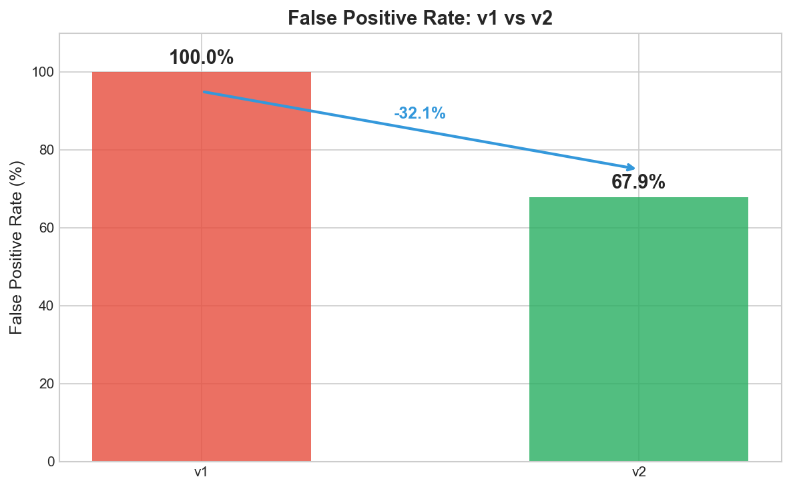
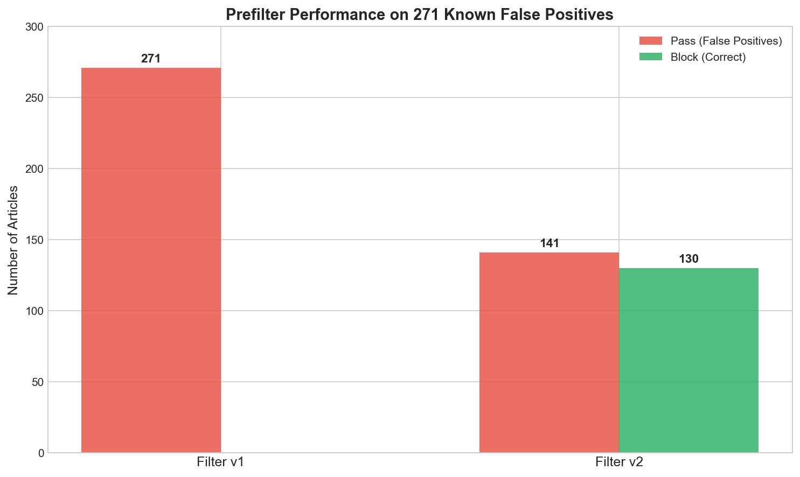
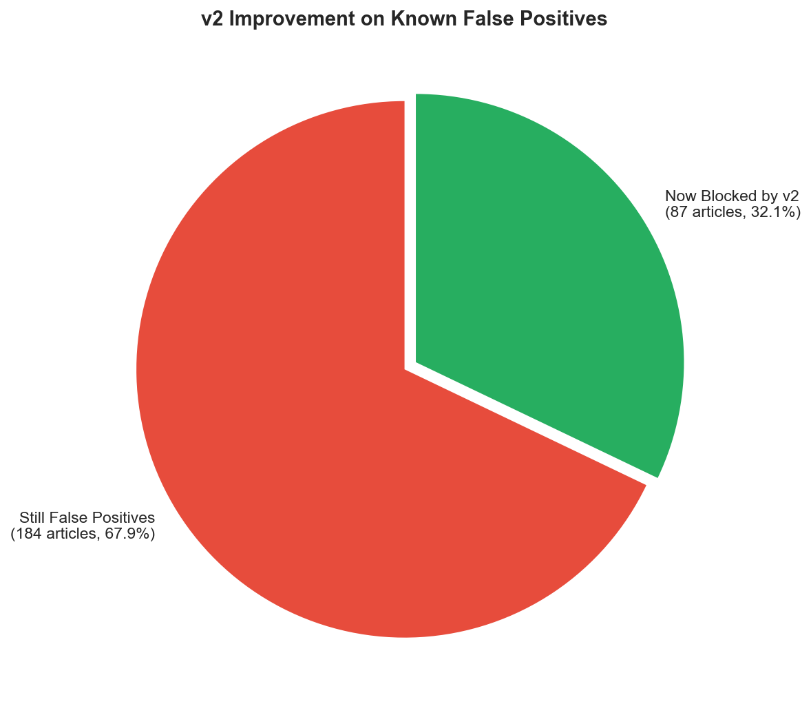

# Sustainability Technology Filter: v1 vs v2 Comparison

**Generated:** 2026-01-16
**Test Set:** 271 manually identified false positives

## Executive Summary

Testing both filter versions on **271 known false positives** - articles that v1 incorrectly classified as "medium" tier but should be "low/off-topic" based on manual review.

| Metric | v1 | v2 | Improvement |
|--------|----|----|-------------|
| **False Positive Rate** | 100.0% | 67.9% | **-32.1%** |
| Articles passing prefilter | 271 | 184 | -87 |
| Articles correctly blocked | 0 | 87 | +87 |

### Key Finding

**v2 reduces false positives by 32.1%** - blocking 87 articles that v1 incorrectly passed, with **zero regressions**.

## Detailed Breakdown

| Category | Count | % of Total |
|----------|-------|------------|
| Both pass (still FP) | 184 | 67.9% |
| Both block (already caught) | 0 | 0.0% |
| **v1 pass → v2 block (improvement)** | 87 | 32.1% |
| v1 block → v2 pass (regression) | 0 | 0.0% |

## What v2 Catches That v1 Missed

The v2 prefilter includes new exclusion patterns that correctly identify:

### Consumer Electronics (CES announcements, product reviews)
- Samsung Galaxy Book series launches
- TCL SQD-Mini LED TVs
- JLab wireless earbuds
- Anker chargers and docks
- Apple Watch pricing articles

### AI/ML Infrastructure (not sustainability-focused)
- "Sketch to Adapt: Fine-Tunable Sketches for Efficient LLM Adaptation"
- "MSched: GPU Multitasking via Proactive Memory Scheduling"
- "Optimized Hybrid Feature Engineering for Resource-Efficient Arrhythmia Detection"

### Developer Tutorials
- "How I Translated 277 Strings in 5 Minutes"
- Programming how-to articles

## Sample Improvements (v1 pass → v2 block)

Articles that v2 correctly rejects with specific reasons:

| Article | v2 Rejection Reason |
|---------|---------------------|
| Samsung's Galaxy Book 6 series launches at CES | `excluded_consumer_electronics` |
| Sketch to Adapt: Fine-Tunable Sketches for Efficient LLM Adaptation | `excluded_ai_ml_infrastructure` |
| MSched: GPU Multitasking via Proactive Memory Scheduling | `excluded_consumer_electronics` |
| Optimized Hybrid Feature Engineering for Resource-Efficient Arrhythmia Detection | `excluded_ai_ml_infrastructure` |
| How I Translated 277 Strings in 5 Minutes | `excluded_ai_ml_infrastructure` |

## Remaining False Positives (184 articles)

Articles that still slip through v2 - potential areas for v3 improvement:

| Article | Category |
|---------|----------|
| TCL unveils its X11L SQD-Mini LED TVs at CES 2026 | Consumer electronics |
| Narwal's first mattress vacuum | Home appliances |
| Samsung HW-QS90H soundbar hands-on | Consumer electronics |
| Detection of Malaria Infection from parasite-free blood smears | Medical AI (not sustainability) |
| OBS-Diff: Accurate Pruning For Diffusion Models | AI infrastructure |
| JLab adds ANC to its tiny wireless earbuds | Consumer electronics |
| Anker unveils a new lineup of chargers | Consumer electronics |
| GE Appliances' new Smart Refrigerator | Home appliances |
| The Apple Watch Series 11 is at the lowest price | Consumer electronics deals |

### Pattern Analysis of Remaining FPs

Many remaining false positives are:
1. **CES product announcements** - need stronger CES/trade show detection
2. **Consumer electronics** - current patterns may need brand expansion
3. **Medical/health AI** - not sustainability, but passes current filters

## Recommendations for v3

1. **Expand CES/trade show detection** - block articles mentioning major tech events
2. **Add more consumer electronics brands** - TCL, JLab, Anker, Narwal, GE Appliances
3. **Consider medical AI exclusion** - unless specifically about sustainable healthcare
4. **Product deal/pricing articles** - "lowest price we've seen" patterns

## Conclusion

**v2 is a significant improvement** over v1:
- 32.1% reduction in false positives
- Zero regressions
- Clear categorization of why articles are blocked

The remaining 67.9% false positive rate indicates room for v3 improvements, particularly around consumer electronics and CES coverage.

---

## Methodology

1. **Ground Truth:** 271 manually reviewed articles from NexusMind production
2. **Test:** Run both v1 and v2 prefilters on same articles
3. **Comparison:** Count pass/block rates and categorize changes
4. **Script:** `compare_v1_v2.py` in this directory
